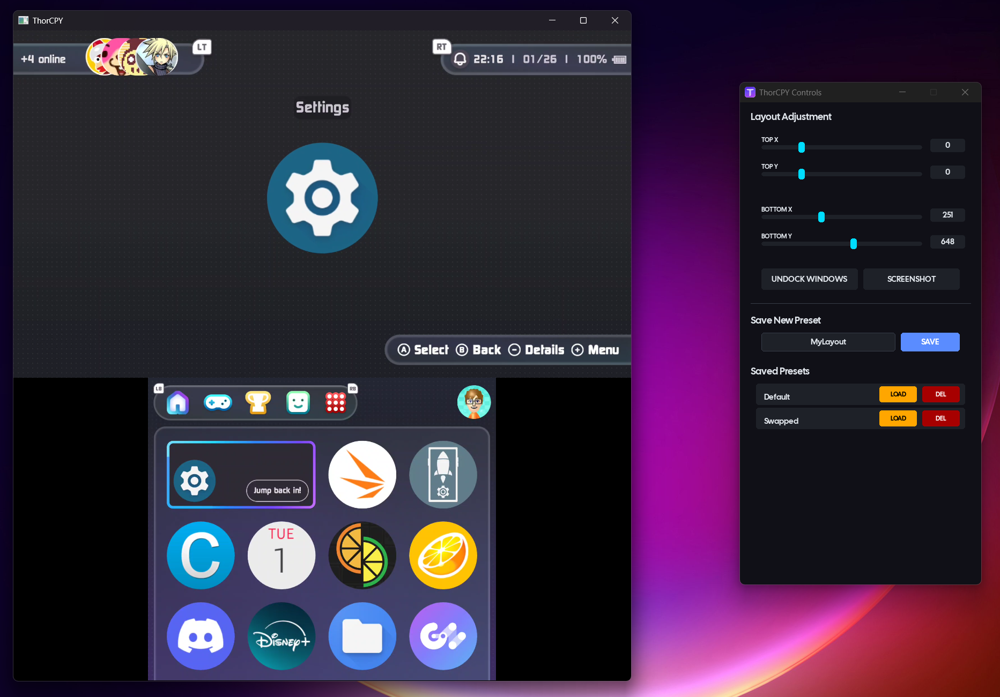
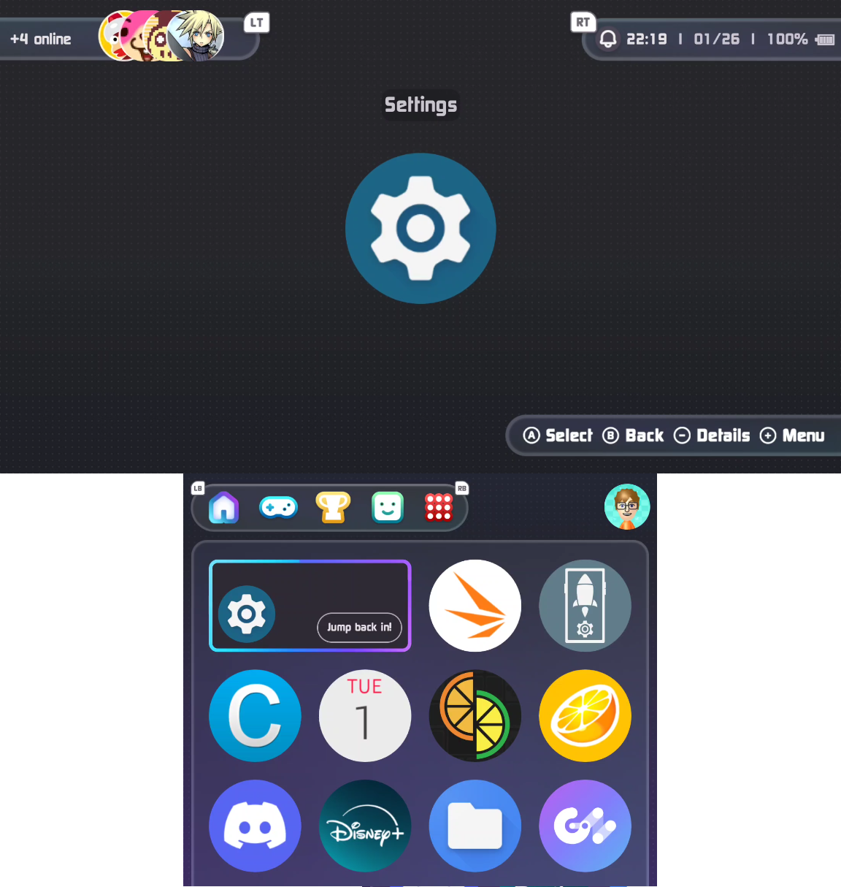

<p align="center">
  
</p>

# ThorCPY

ThorCPY is a Windows-based multi-window Scrcpy launcher, designed specifically for the AYN Thor.
It features a layout editor, window docking, screenshots, and window moving.

It launches two scrcpy windows (one for each display), and embeds them into a native windows container.
Designed for screensharing, recording or livestreaming.

**The current build is broken on Windows 10. A solution has been found and implemented, and will be included in the next release if no more issues arise**


| Main UI                            | ThorCPY Screenshot                             |
|------------------------------------|------------------------------------------------|
|  |  |


## Features:

- Custom dual-screen support built for the AYN Thor
- Dock screenshares in a window, or separate them for specific screen captures
- Layout presets allow you to display the screens precisely the way you want
- Screenshot capture takes a beautiful screenshot of both screens, including transparency where the screens aren't!
- Real-time positioning allows you to move the screens around into whatever position you want

Technical Features:
- Comprehensive logging
- Automatic device detection via ADB
- Thread-safe window managing
- Graceful error handling and recovery
- PyInstaller support for standalone executables

## Installation:

> **To use ThorCPY, you must have ***USB Debugging*** enabled.**
> **To install ***USB Debugging***:**
> 1) **On the device, go to Settings > About device.**
> 2) **Tap the Build number seven times to make Settings > Developer options available.**
> 3) **Then, enable the USB Debugging option from the Developer options.**
> You must then connect your thor via USB to your computer 


### Option 1: Standalone Executable    
 - Prebuilt executables can be found in [Releases](https://github.com/theswest/ThorCPY/releases)

### Option 2: Run from Source:
> Note: Pygame does not have a wheel for Python 3.14 yet. Please use a lower version!
1) Clone the repository:
	- `git clone https://github.com/theswest/ThorCPY.git`
	- `cd ThorCPY`
2) Install Python dependencies:
	- `pip install -r requirements.txt`
3) Run ThorCPY
	- `python main.py`

### Option 3: Build from Source:
 1) Install PyInstaller:
	- `pip install pyinstaller`
2) Run the build script:
	- `python build.py`
3) Find your executable:
	- Located in `dist/ThorCPY.exe`
	- Ensure that the executable must be placed in a folder with `bin/`, `config/` and `logs/`

**Note:** scrcpy and ADB binaries are included in the `bin/` folder for your convenience.

## Bundled Software:

ThorCPY includes the following third-party software:
- **scrcpy v3.3.4** by Genymobile/Romain Vimont
- Licensed under Apache License 2.0
- See `bin/LICENSE_scrcpy.txt` for full license text
- Source: https://github.com/Genymobile/scrcpy

This bundled software is unmodified and used as-is for the convenience of end users.

To manually create the `bin` folder, simply extract the [latest release of scrcpy](https://github.com/Genymobile/scrcpy/releases/tag/v3.3.4) to `bin/`


## Requirements:

System:
- OS: Windows 11 (Theoretically also Windows 10 (1809+))
- Python 3.8 or higher when running from source
- **Device**: AYN Thor with USB debugging enabled

Included Dependencies:
- ADB (Android Debug Bridge) - in `bin/` folder
- scrcpy binary - in `bin/` folder

Python Dependencies:
-  See [requirements.txt](https://github.com/theswest/ThorCPY/blob/master/requirements.txt) for the full list. Install with:
	- `pip install -r requirements.txt`

## Usage:

Control Panel:
- The ThorCPY control panel appears on the right hand side of your screen with the following controls:
- Layout Adjustment:
	- Top X/Top Y:
		- Adjust position of top screen
	- BOTTOM X/BOTTOM Y
		- Adjust position of bottom screen
- Window Controls:
	- Undock windows: Separate windows into independent floating windows (for individual window capture e.g. streaming layout)
	 - Dock windows: Bring undocked windows back into one, unified window
	 - Screenshot: Capture the entire docked view to clipboard (only works when docked)
- Preset Management:
	- Adjust your layout as desired
	 - Enter a name into the preset field
	 - Click "SAVE" to save the layout as a preset
	 - Click "LOAD" next to a previously saved preset to apply it
	 - Click "DEL" next to a previously saved preset to remove it


## Configuration:

Layouts/Presets:
- Presets are stored in config/layout.json
- You can manually edit this file if needed:
```json title:layout.json
{
    "Default": {
        "tx": 0,
        "ty": 0,
        "bx": 251,
        "by": 648
    },
    "Streaming": {
        "tx": 100,
        "ty": 50,
        "bx": 300,
        "by": 700
    }
}
```

Scaling:
- The default scaling is set to 0.6 (60% of original resolution).
- An easier way to change this will be added in the future, for now you can modify `global_scale` in `launcher.py`.
- `self.global_scale = 0.6  # Change to desired scale (0.3 to 1.0 recommended)`

Logging:
- Logs are automatically saved to logs/, with daily rotation. Log files are named:
	 - `thorcpy_YYYYMMDD.log` - Main application log
	 - `thorcpy_top_YYYYMMDD_HHMMSS.log` - Top window scrcpy output
	 - `thorcpy_bottom_YYYYMMDD_HHMMSS.log` - Bottom window scrcpy output
- To adjust log verbosity, modify the logging level in `main.py`:
```python title=main.py
logging.basicConfig(
	level=logging.INFO, # Change to DEBUG for detailed logs
	...
)
```

## Troubleshooting:

Device Not Found:
- Ensure USB debugging is enabled on your Thor - Try a different USB cable (Ensure data cable, not charging-only)
- Revoke USB debugging authorizations and reconnect:
	- Settings -> System -> Developer Options -> Revoke USB debugging authorizations
- Check if ADB can see your device: `bin/adb.exe devices`
- Restart ADB server: `bin/adb.exe kill-server` then `bin/adb.exe start-server`

Scrcpy won't start:
- Ensure that scrcpy.exe is in the bin/ folder
- Check logs for detailed error messages
- Try running scrcpy manually: `bin/scrcpy.exe -s YOUR_DEVICE_SERIAL`
- Update to the latest scrcpy version
- Ensure your device has the required display IDs (0 and 4)

Windows Won't Dock:    
 - Wait a few seconds for windows to initialize
 - Try toggling dock/undock multiple times
 - Restart the application
 - Check logs for any errors

Performance Issues:    
 - Reduce the global scale
 - Close other resource-intensive applications
 - Use a USB 3 port
 - Lower the max FPS in launcher.py (change --max-fps)
 - Reduce the video bitrate in scrcpy_manager.py

Missing DLL or Import Errors
 - Reinstall dependencies: `pip install -r requirements.txt --force-reinstall`
 - Ensure Python 3.8+ is installed
 - Install Visual C++ Redistributables


## Licenses

 - This project is licensed under the **GNU General Public License v3.0** - see the LICENSE file for details, [here](https://github.com/theswest/ThorCPY/blob/master/bin/LICENSE).
 - You are free to modify and redistribute it under the same terms.
 - [Scrcpy](https://github.com/Genymobile/scrcpy) uses Apache License 2.0, which the LICENSE file can be found [here](https://github.com/theswest/ThorCPY/blob/master/bin/LICENSE_scrcpy.txt).
 - The font used in-app is [Cal Sans](https://github.com/calcom/font), which uses the SIL Open Font License 1.1. The LICENSE file can be found [here](https://github.com/theswest/ThorCPY/blob/master/assets/fonts/OFL.txt)


## Contributing:

Contributions are more than welcome! This started as a personal project but it was released after several requests.
Feel free to submit a pull request. For major changes, please open an issue first to discuss what you would like to change.
This was originally built as a quick personal tool, so refactoring PRs are especially welcome!


## Acknowledgements:

- **[eldermonkey](https://github.com/eldermonkey)** - For making the incredible logo
- **[scrcpy](https://github.com/Genymobile/scrcpy)** by Romain Vimont - The backend that makes this all possible
- **[Cal Sans](https://github.com/calcom/font)** by Cal.com Inc. - UI typography (SIL Open Font License 1.1)
- **[Pygame](https://www.pygame.org/)** - UI rendering and event handling
- **Microsoft** - Windows API documentation
- All contributors and testers!
